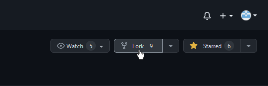
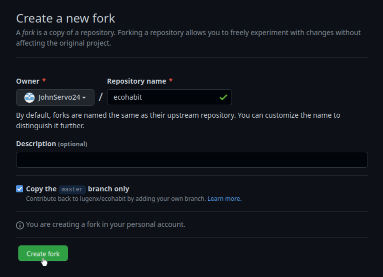
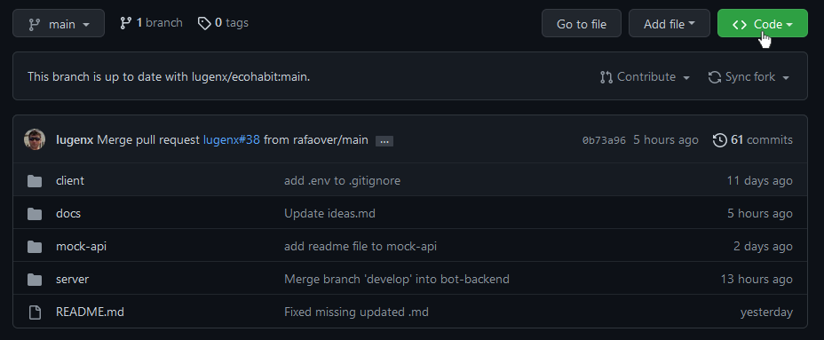
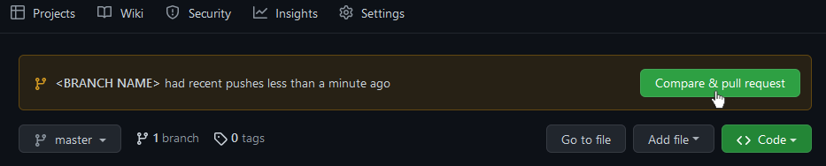
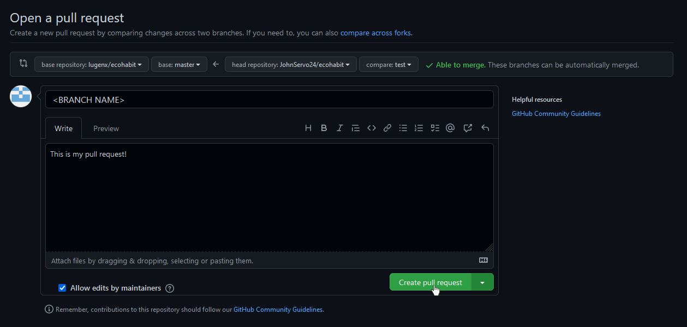
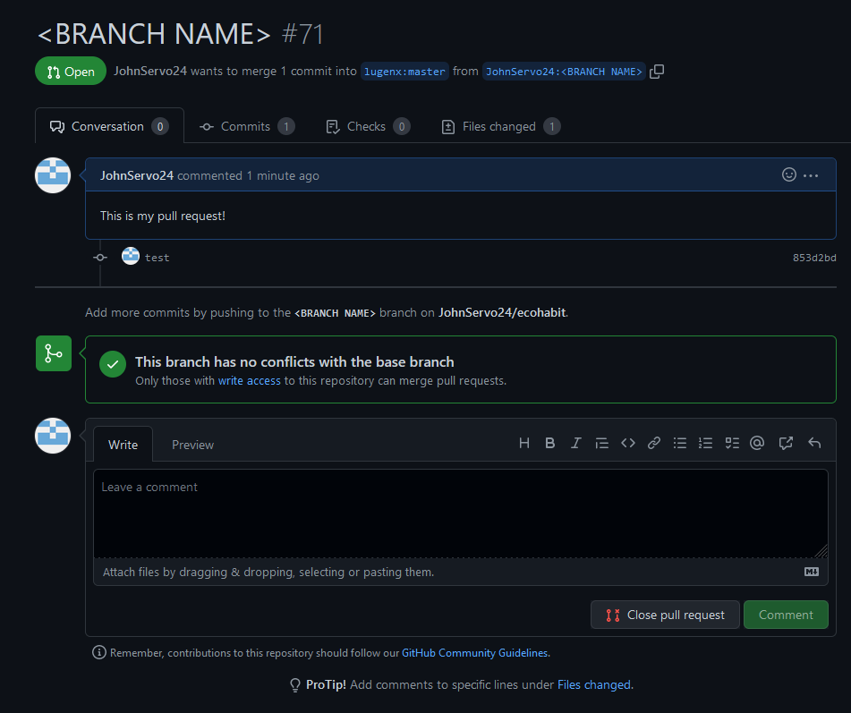

# How to contribute

First of all, we really appreciate your intention to contribute to this project! All contributions are welcome, whether it would be adding more features, creatinglugen documentation, fixing typos and more.

To contribute, you would need a GitHub account and Git installed on your computer. Creating a GitHub account and installing Git is not the issue of this guide. 

This guide assumes that you are already accustomed to elementary Git/GitHub usage.

## Here are the steps to contribute to this project

### 1. Fork this repository

The most common contribution path starts with forking the project which can be easily done with a web browser of your choice.

Visit the [ecohabit repo page](https://github.com/lugenx/ecohabit") on your browser. Next, find the `fork` button somewhere around the top right of the page and press this button. 



Once you have pressed the `fork` button, GitHub will redirect you to a page that looks like this:



Press the `Create fork` button to fork the repository. It should redirect you into your own copy of the repo.

By doing this, you are creating a copy of the ecohabit repo into your account. This way, you can make changes to the codebase without affecting the original repo.


### 2. Clone this repository

Now that your GitHub account has an exact copy of the project via forking, it's time to get a copy on your computer. This way, you can make changes to the project.

After forking, it should redirect you into your own copy of the repo. Select the green `Code` button somewhere in the middle of the page. It should be next to the `Add file` button, and it should be the only green button on the entire page if you're using the default GitHub theme.



Next, copy the link under the HTTPS tab by tapping the button right beside it.


If you prefer to clone via SSH, feel free to go that route instead.

---
Another way of getting the link for cloning is to use this format: 

```
https://github.com/<YOUR GITHUB NAME>/ecohabit
```
---

Now that we have copied the link to our repo, grab your favorite terminal and navigate to the directory where you want to store the project, then run this command:

```
git clone <THE LINK THAT YOU'VE COPIED>
```

If you receive no errors, congratulations! You now have a local copy of the project on your computer. But we're not done yet. Before we can make changes to the program, we need to do a few more things first.

### 3. Create a branch

Right after cloning, run this command on your terminal:

```
git checkout -b <YOUR BRANCH NAME>
```
This will create a separate branch of the project, which is basically just another version of the project. This way, we have two versions, or 'branches' of the project: The 'main' branch -  which is the original branch - and the branch that we've created. As much as possible, we must apply our changes to the separate branches instead of the main branch. We can create as many branches as we want.

### 4. Making sure that your copy of the repo is always up to date

As we are working on our features, the original repo might be updated by other people which will make our fork out of date.

To prevent this, run this command on your terminal:

```
git remote add upstream https://github.com/lugenx/ecohabit
```

This command will connect your fork to the original repo so that you can make and receive commits to and from the original repo.

If there are new updates, make sure to run `git fetch --all` to get the latest version of the repo.

### 5. Making changes to the project and commiting those changes

Now that we have set everything, you can now run your favorite editor/IDE and start making changes to the project.

After you've made some changes, try running this command:

```
git status
```

This command will show the changes that you've made and their current status.

If you are confident with your changes, it's time to add them to the staging area. To add all of your changes into the staging area and set their status to "to be commited", run this command:

```
git add .
```


You may check the status of your changes by running the `git status` command again.

Now it's time to commit our changes. To commit your changes, run this command:

```
git commit -m "your message"
```
---
**NOTE:** It is very important to add a message to your commits!


Your message should inform the other contributors about the changes that you've made and why this project needs them.

---

It's time for our last terminal command:

```
git push -u origin <YOUR BRANCH NAME>
```

This will push our changes to the original repo. Now we have to make a Pull Request to make the feature that we've been working on official.

### 6. Submitting your changes for review

It is time to get back to the web browser. Navigate to the [ecohabit repo page](https://github.com/lugenx/ecohabit")

Look for a green `Compare & pull request` button. Once you've found it, click the button.



Feel free to change the title and write some more info. Once finished, click on the `Create pull request` button.



If there are no errors, it should redirect you to a page that looks like this:



Congratulations! You have successfully made a Pull Request, and you did your very first contribution. Now we have to wait for the maintainers to review and check your Pull Request. Once the maintainers have deemed your contribution to be worthy, they will accept your Pull Request.


